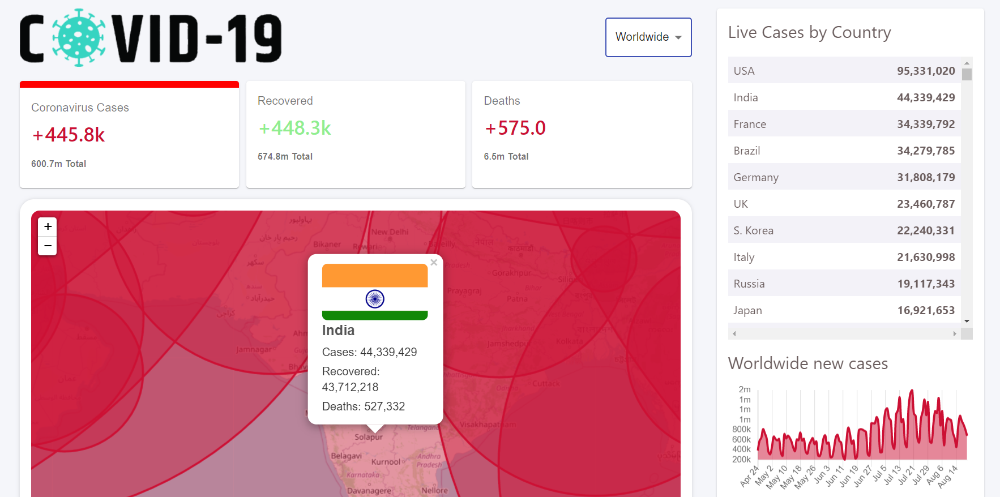

Live Site:

API used: 
1. Getting all the details : https://disease.sh/v3/covid-19/all 
1. Getting details of all the countries : https://disease.sh/v3/covid-19/countries
1. Getting details of particular country : https://disease.sh/v3/covid-19/countries/${countryCode}